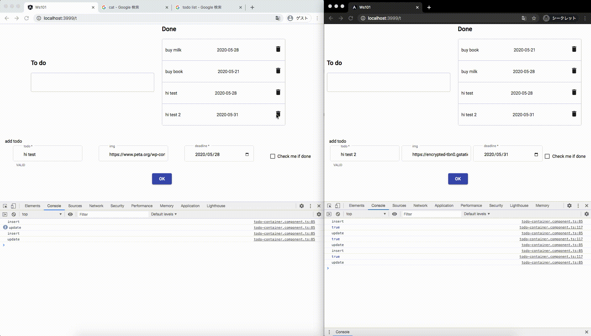

# Ws101
## Practice project　
### Learning ngrx data and websocket
WebSocket todo list with ngrx-data

fontend:https://github.com/chobijaeyu/todoListAngular
backend:https://github.com/chobijaeyu/todoListGin

here  is 🐛bug when add todo and delete it immediately，

